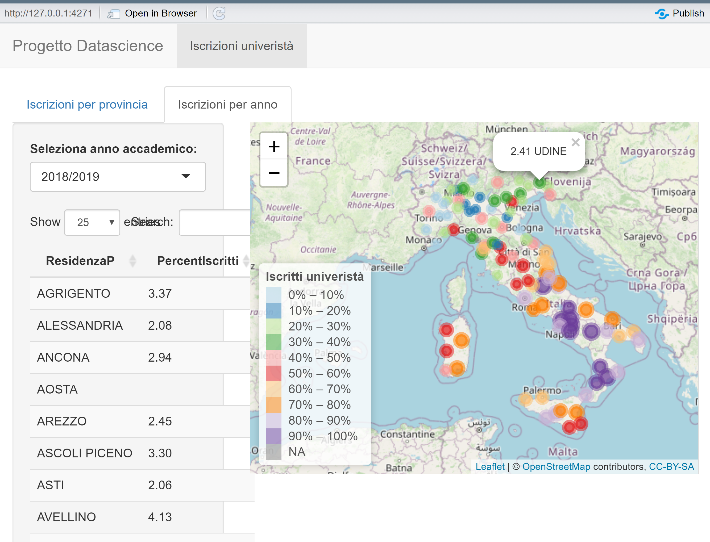

```{r setup, include=FALSE}
knitr::opts_chunk$set(echo = TRUE)
```

# Analisi iscrizioni universitarie negli anni

Andremmo ad analizzare le iscrizioni universitarie nelle varie province italiane dal 2010 al 2022 in modo da poter rispondere alle domande:

1.  Quali sono stati gli anni con il maggior numero di iscrizioni univeristarie?

2.  Qual'è l'andamento nazionale e per singola provincia

3.  Come sono ditribute le iscrizioni univesitarie in Italia?

## Il dataset

Il dataset è stato creato dal unione e la rielaborazione di più datasets, ad ogni dataset è associato uno script per il carciamento e l' elaborazione dei dati.

### Dataset iscrizioni univeristarie

Il primo script elabora un dataset con il numero di iscritti universitari divisi per provincia italiana, il dataset di partenza è composto da Anno Accademico, Provincia, Sesso e numero di iscritti.

Lo script è in oltre composto da diverse funzioni utili per l' estrazione dei dati:

```{r}
if(!exists("foo", mode="function")) source("db_universita.r")
head(xResidenza)
```

Andiamo ora ad analizzare il numero di iscritti selezionando ad esempio la provincia di udine:

```{r}
library(dplyr)
library(ggplot2)
iscrittiUD <- iscrittiByProvincia("UDINE")
(iscrittiUD)
iscrittiUD[which.max(iscrittiUD$IscrittiTot),]
iscrittiUD[which.min(iscrittiUD$IscrittiTot),]
ggplot(iscrittiUD,aes(y=AnnoA,x=IscrittiTot)) +
    geom_col()+
    geom_text(aes(label = IscrittiTot)) 
paste(("Media:"),mean(iscrittiUD$IscrittiTot) )
paste(("Varianza:"),var(iscrittiUD$IscrittiTot))
```

Possiamo notare dal grafico che dal 2010 al 2015 le iscrizioni al univeristà in provincia di Udine sono scese fino a raggiugere il picco minimo nel anno accademico del 2014/2015, per poi ricominciare a salire nuovamente ogni anno di più fino a raggiugere il picco massimo proprio nello scorso anno accademico

```{r}
iscritti2020MF <- iscrittiByAnno("2020/2021")
(iscritti2020MF)
paste(("Media iscritti femmine:"),mean(filter(iscritti2020MF, iscritti2020MF$SESSO == 'F')$Isc) )
paste(("Media iscritti maschi:"),mean(filter(iscritti2020MF, iscritti2020MF$SESSO == 'M')$Isc) )
iscritti <- iscrittiTotPerAnno()
(iscritti)
#Anno e provincia con più iscrizioni
(iscritti[which.max(iscritti$IscrittiTot),])
```

### Dataset residenti

Il dataset residenti serve per poi calcolare la precentuale degli iscritti in modo da poter studiare il numero di iscrizioni relative alla popolazione delle province.

```{r}
if(!exists("foo", mode="function")) source("db_residenti.r")
```

Il dataset è stato composto unendo un dataset con gli abitanti dal 2010 al 2019 e altri due dataset con gli iscritti del 2020 2021

```{r}
View(abitantidb)
```

Da questo dataset calcoliamo poi le percentuali di iscritti per ogni provincia

```{r}
percentualeIscritti <- iscrittiTotPercentuale()
```

## Unione dati e studio

Dopo aver costruito i vari dataset con le informazioni che ci servivano li uniamo in un solo dataset su cui fare le analisi.

```{r}
if(!exists("foo", mode="function")) source("unioneDatasets.r")
View(dbCompleto)
```

Il dataset completo è costiuito da Regione e Provincia, Anno Solare e Accademico, Iscrizioni universitari, Residenti nella provincia e numero di iscritti in percentuale.

```{r}
db2010 <- dbCompletoPerAnno('2010/2011')
db2011 <- dbCompletoPerAnno('2011/2012')
db2012 <- dbCompletoPerAnno('2012/2013')
db2013 <- dbCompletoPerAnno('2013/2014')
db2014 <- dbCompletoPerAnno('2014/2015')
db2015 <- dbCompletoPerAnno('2015/2016')
db2016 <- dbCompletoPerAnno('2016/2017')
db2017 <- dbCompletoPerAnno('2017/2018')
db2018 <- dbCompletoPerAnno('2018/2019')
db2019 <- dbCompletoPerAnno('2019/2020')
db2020 <- dbCompletoPerAnno('2020/2021')
db2021 <- dbCompletoPerAnno('2021/2022')
anno <- c(
      '2010',
      '2011', 
      '2012', 
      '2013', 
      '2014', 
      '2015', 
      '2016', 
      '2017', 
      '2018', 
      '2019', 
      '2020', 
      '2021' 
    )
medie <- c(
  round(mean(db2010$PercentIscritti, na.rm=TRUE),digits = 2),
  round(mean(db2011$PercentIscritti, na.rm=TRUE),digits = 2),
  round(mean(db2012$PercentIscritti, na.rm=TRUE),digits = 2),
  round(mean(db2013$PercentIscritti, na.rm=TRUE),digits = 2),
  round(mean(db2014$PercentIscritti, na.rm=TRUE),digits = 2),
  round(mean(db2015$PercentIscritti, na.rm=TRUE),digits = 2),
  round(mean(db2016$PercentIscritti, na.rm=TRUE),digits = 2),
  round(mean(db2017$PercentIscritti, na.rm=TRUE),digits = 2),
  round(mean(db2018$PercentIscritti, na.rm=TRUE),digits = 2),  
  round(mean(db2019$PercentIscritti, na.rm=TRUE),digits = 2),  
  round(mean(db2020$PercentIscritti, na.rm=TRUE),digits = 2), 
  round(mean(db2021$PercentIscritti, na.rm=TRUE),digits = 2))
dbMedie <- data.frame(anno, medie)

```

Creiamo ora un istogramma con le medie delle percentuali di iscrizioni delle varie province per capire se le iscrizioni negli ultimi 10 anni è aumentata o diminuità.

Come possiamo notare dal istogramma le iscrizioni in precentuale sono rimaste regolari, non sono aumentate o diminuite di molto, con un picco di iscrizioni nel 2020/2021.

```{r}
ggplot(dbMedie,aes(y=medie,x=anno))+
    geom_histogram(stat='identity',fill="lightblue")+
    geom_text(aes(label = medie), vjust = 1.5, colour = "black")
```

## La Web APP

Per avere una visione più dinamica dei contenuti è stata creata una pagina web.

Vi sono due viste:

1.  Istogramma del andamento delle iscirzioni per la provincia selezionata.

2.  Mappa del italia con le percentuali delle province idicate da colore e raggio dei cerchi nel anno selezionato

Dalle mappe dei vari anni si può notare che la percentuale di isciritti al università è maggiore al sud rispetto che al nord.



```{r}
if(!exists("foo", mode="function")) source("app.r")
```

Per l' avvio del applicazione andare nel file e avviare l' applicazione.
